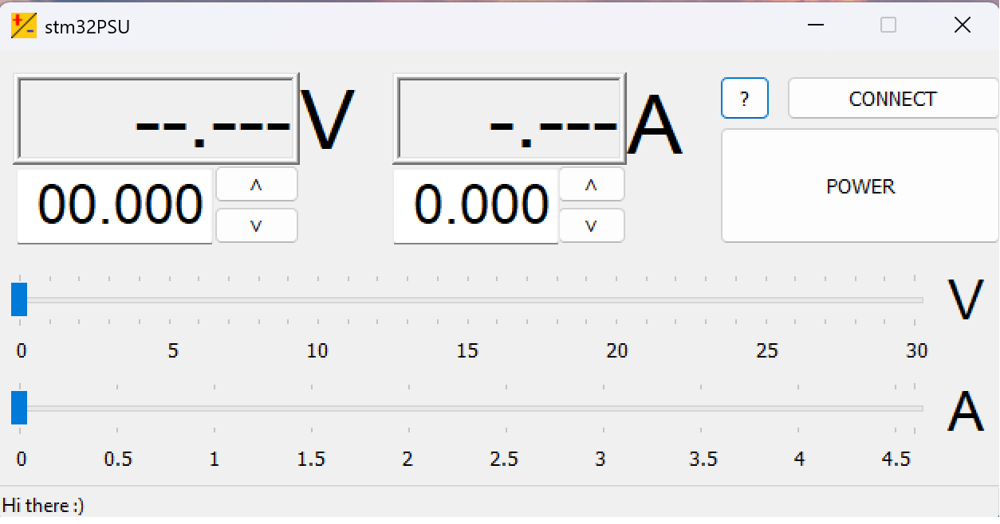

						stm32PSU

[БГ]  stm32PSU е комуникационна програма за управление на линейно захранване
модел PSU_F030CCT6 чрез персонален компютър с операционна система Windows.
За да осъществите връзка с линейното захранване е необходимо да разполагате
с активен интерфейсен кабел модел iSTM32PSU-IIC. За да получите изпълним
файл (програма) е необходимо да компилирате проектните файлове от този
репозиторий с Microsoft Visual Studio или да свалите изпълним файл от
https://stm32dds.tk/stm32-psu . Информация как да си направите “активен”
интерфейсен кабел можете да получите също от този сайт. Фърмуерът за
програмирането на този “кабел” можете да свалите от репозиторий
https://github.com/stm32dds/iSTM32PSU-IIC  или сайта по-горе. 

[EN] stm32PSU is a communication program for controlling a linear power supply
model PSU_F030CCT6 through a personal computer with Windows operating system.
To connect to the linear power supply, you need to have an active interface
cable model iSTM32PSU-IIC. To get an executable file (program), you need to
compile the project files from this repository with Microsoft Visual Studio or
download an executable file from https://stm32dds.tk/stm32-psu . Information
on how to make an "active" interface cable can also be obtained from this site.
You can download the firmware for programming this "cable" from the repository
https://github.com/stm32dds/iSTM32PSU-IIC or the site above. 
